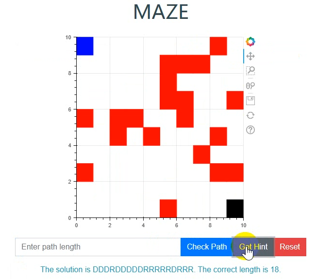

# Maze-Python-Flask-React

技术栈：前端React,后端Python Flask

涉及组件：后端Bokeh生成图表，前端BokehJS渲染拿到的Bokeh格式图表，Bootstrap页面美化。

## 项目介绍

用 Python Flask 后端框架和任意前端框架搭建一个“生成迷宫&解迷宫”网页，功能如下：

1）后端随机生成一个大小为 10*10 迷宫，包含最短路径的长度作为属性，用 python Bokeh 进行可视化在页面中显示，红色代表障碍物，白色代表可通行路径，起点和终点随机生成并在页面中标注，起点为蓝色方块，终点为黑色。

2）用户需要判断该迷宫是否存在一条从起点到终点的路径， 若存在，则需要输入最短路径的长度

3）后端判断用户的答案是否正确，给出相应提示。若正确，则进入下一题，生成新的迷宫。

4）若用户无法解题，可以点击提示按钮，获取最短路径信息，以字符串表示，“D”代表向下移动，“U”代表向上移动，“L”向左，”R”向右，并在途中绘制路径。要求：如果有多条最短路径，则给出字典序最小的一个；若不存在路径，则直接跳转下一题。 页面示例如上传的附件图。
我使用Win10, Pycharm。

## 执行

后端： `python ./backend/app.py`

前端： 到frontend中，执行`npm start`

打开 http://localhost:50190/ 即可查看效果。

### 执行结果

也可以观看 maze-pythonflask-demo.wmv 